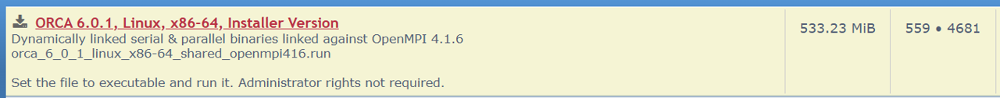

## Installing drFrankenstein
### Manual steps
**drFrankenstein** leverages the programs **ORCA**, **XTB**, and **MultiWFN**. You will need to install these programs manually before running drFrankenstein.

---

#### 1. Install ORCA


1. Download the ORCA 6.0.1 binary installer from: [The ORCA Forum](https://orcaforum.kofo.mpg.de/app.php/dlext/?cat=25)



2. Place the installer in your ~/bin/ directory (or equivalent)

3. Give yourself permission to run the ORCA binary installer:
```bash
chmod +x ~/bin/orca_6_0_1_linux_x86-64_shared_openmpi416.run
```
4. Run the installer
```bash
~/bin/orca_6_0_1_linux_x86-64_shared_openmpi416.run
```
This will create the `orca_6_0_1_linux_x86-64_shared_openmpi416` directory in your `bin` directory
Inside this directory, you will find the `orca` binary, you will need to supply the full path to this binary to drFrankenstein via the `pathInfo`.`orcaExe` parameter in all of your config.yaml files.

---


#### 2. Get XTB2 for ORCA


1. Download the XTB2 files as a tarball from GutHub:
https://github.com/grimme-lab/xtb/releases/tag/v6.7.1


2. Place the tarball in your ~/bin/ directory (or equivalent) 

3. Untar the tarball.
```bash
tar -xvf xtb-6.7.1-linux-x86_64.tar.xz
```
> This will create a `~/bin/xtb-dist/` directory

4.  Copy the binary `~/bin/xtb-dist/bin/xtb` to the ORCA install directory, renaming it `otool_xtb`:
```bash
cp ~/bin/xtb-dist/bin/xtb ~/bin/orca_6_0_1_linux_x86-64_shared_openmpi416/otool_xtb
```
>This will allow ORCA to run calculations with the XTB2 method

---

#### 3. Get MultiWFN
1. Download the **MultiWFN noGUI** files from the [Sobereva website](http://sobereva.com/multiwfn/download.html)


2. Place the zip file in your ~/bin/ directory (or equivalent)

3. Unzip the zip file. 
```bash
unzip ~/bin/Multiwfn_3.8_dev_bin_Linux_noGUI.zip
```

>This will create a `~/bin/Multiwfn_3.8_dev_bin_Linux_noGUI/` directory. You will need to supply drFrankenstein with the full path to this directory in the `pathInfo`.`multiWfnDir` parameter in all of your config.yaml files


### Automated Steps
1. Clone the  **drFrankenstein** repository
```bash
git clone https://github.com/wells-wood-research/drFrankenstein
```

2. Make and activate the **Igor** conda environment using environment.yaml
```bash
conda env create -f environment.yaml
conda activate Igor
```

### A Note on CGenFF for CHARMM parameters
In order to create CHARMM parameters, drFrankenstein requires a stream (.STR) file of your capped molecule to be generated. This needs to be created using **CGenFF**. **CGenFF** is primarily available as a server-based service. For local installation of **CGenFF**, one must request permission from [TODO].

drFrankenstein was built to function with both server-based **CGenFF** and local **CGenFF** installations. 
- If you have **CGenFF** installed locally, you will need to supply the location of its binary using the `pathInfo`.`cgenffExe` parameter in all of your config.yaml files. Once this has been done, drFrankenstein will be able to generated CHARMM parameters in a fully-automated manner.

- If you wish to use the CGenFF Server instead, simply set your `pathInfo`.`cgenffExe` to `Null`. After adding capping groups to your molecule, drFrankenstein will terminate itself and prompt you to upload your capped molecule (in the MOL2 format, which drFrankenstein will create for you) to the server https://cgenff.com/. Once you have created CHARMM stream (.STR) file, simply place it in your `pathInfo`.`inputDir` directory. You can then re-run drFrankenstein using the same config file to resume CHARMM parameter generation.
