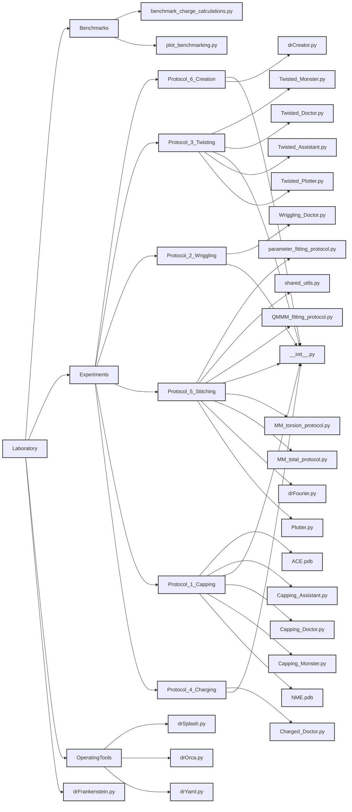

```mermaid
flowchart LR
  linkStyle default interpolate basis
  classDef default stroke-width:2px,stroke:#333
    Laboratory --> Benchmarks
    Laboratory --> Experiments
    Laboratory --> OperatingTools
    Laboratory --> drFrankenstein.py
    Benchmarks --> benchmark_charge_calculations.py
    Benchmarks --> plot_benchmarking.py
    Experiments --> Protocol_6_Creation
    Experiments --> Protocol_3_Twisting
    Experiments --> Protocol_2_Wriggling
    Experiments --> Protocol_5_Stitching
    Experiments --> Protocol_1_Capping
    Experiments --> Protocol_4_Charging
    Protocol_6_Creation --> __init__.py
    Protocol_6_Creation --> drCreator.py
    Protocol_3_Twisting --> Twisted_Monster.py
    Protocol_3_Twisting --> Twisted_Doctor.py
    Protocol_3_Twisting --> __init__.py
    Protocol_3_Twisting --> Twisted_Assistant.py
    Protocol_3_Twisting --> Twisted_Plotter.py
    Protocol_2_Wriggling --> Wriggling_Doctor.py
    Protocol_2_Wriggling --> __init__.py
    Protocol_5_Stitching --> parameter_fitting_protocol.py
    Protocol_5_Stitching --> shared_utils.py
    Protocol_5_Stitching --> QMMM_fitting_protocol.py
    Protocol_5_Stitching --> __init__.py
    Protocol_5_Stitching --> MM_torsion_protocol.py
    Protocol_5_Stitching --> MM_total_protocol.py
    Protocol_5_Stitching --> drFourier.py
    Protocol_5_Stitching --> Plotter.py
    Protocol_1_Capping --> ACE.pdb
    Protocol_1_Capping --> Capping_Assistant.py
    Protocol_1_Capping --> __init__.py
    Protocol_1_Capping --> Capping_Doctor.py
    Protocol_1_Capping --> Capping_Monster.py
    Protocol_1_Capping --> NME.pdb
    Protocol_4_Charging --> Charged_Doctor.py
    Protocol_4_Charging --> __init__.py
    OperatingTools --> drSplash.py
    OperatingTools --> drOrca.py
    OperatingTools --> drYaml.py
```
